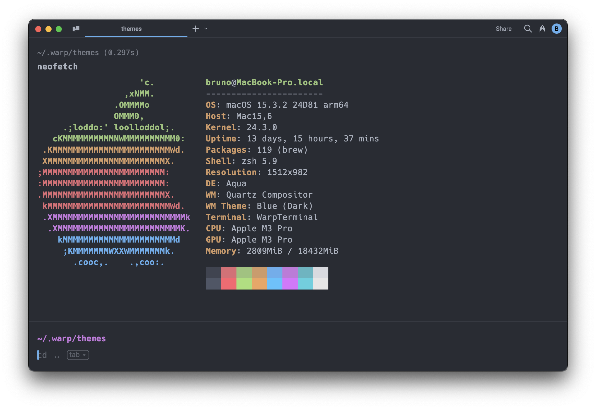

# One Dark for [Warp](https://warp.dev)
A custom theme for Warp based on [One Dark Pro](https://github.com/Binaryify/OneDark-Pro).

## Install

- Create a config directory `~/.warp/themes` in your home directory.
- Download the .yaml theme [file](https://raw.githubusercontent.com/brunordgs/warp-one-dark/main/One_Dark.yaml) from GitHub and copy it to `~/.warp/themes`.
- Change the theme in `Settings > Appearance` (`⌘+,`).

## License
[MIT License](./LICENSE)